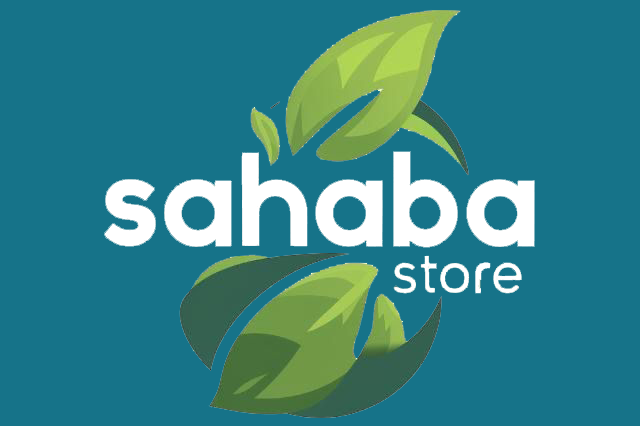

# Sahaba Store - Natural Products E-commerce

## 🌿 Live Website
**[https://sahaba-store.shop](https://sahaba-store.shop)**

## 📋 Overview
Sahaba Store is a modern e-commerce platform specializing in natural products. The website offers a seamless shopping experience with user-friendly navigation, secure payment processing, and comprehensive product management. Built with React.js for the frontend and Node.js/Express.js for the backend, the platform provides both customer-facing features and administrative capabilities.

## ✨ Features

### Customer Features
- **User Authentication**: Secure login and registration system with Firebase integration
- **Product Browsing**: Browse products with filtering and search capabilities
- **Wishlist Management**: Save favorite products for future reference
- **Shopping Cart**: Add products, adjust quantities, and manage cart items
- **Checkout Process**: Multi-step checkout with address and payment information
- **Order Tracking**: View order status and history
- **Responsive Design**: Optimized for all devices from mobile to desktop

### Admin Features
- **Product Management**: Add, edit, and delete products with variants
- **Category Management**: Create and manage product categories
- **Order Management**: Process and update order status
- **User Management**: View and manage user accounts
- **Coupon System**: Create and manage discount coupons
- **Analytics Dashboard**: View sales and user statistics

## 🛠️ Technology Stack

### Frontend
- **React.js**: UI library for building the user interface
- **React Router**: For navigation and routing
- **Tailwind CSS**: For styling and responsive design
- **Vite**: For fast development and building
- **Context API**: For state management
- **Custom Hooks**: For API interactions and data fetching
- **Firebase**: For authentication services

### Backend
- **Node.js**: JavaScript runtime environment
- **Express.js**: Web application framework
- **MongoDB**: NoSQL database for data storage
- **JWT**: For authentication and authorization
- **Cors**: For cross-origin resource sharing
- **Dotenv**: For environment variable management

### Deployment
- **Vercel**: For hosting both frontend and backend

## 🚀 Installation and Setup

### Prerequisites
- Node.js (v14.0.0 or higher)
- npm or yarn
- MongoDB account
- Firebase project (for authentication)

## 📱 Key Functionalities

### Shopping Experience
1. **Product Discovery**: Browse products with filtering options
2. **Product Details**: View detailed information, variants, and related products
3. **Add to Cart/Wishlist**: Easily save or purchase products
4. **Checkout Flow**: Smooth, multi-step checkout process
5. **Order Confirmation**: Detailed order summary and confirmation

### Account Management
1. **Registration/Login**: Create account or sign in securely using Firebase authentication
2. **Order History**: View past orders and their status
3. **Profile Management**: Update personal information
4. **Wishlist**: Manage saved products

### Admin Capabilities
1. **Inventory Management**: Track and update product inventory
2. **Order Processing**: Update order status and manage fulfillment
3. **Content Management**: Update product details and categories
4. **User Management**: Manage customer accounts
5. **Coupon Management**: Create and manage promotional codes

## 📁 Project Structure

### Frontend
- **src/Conponents**: UI components like Navbar, Footer, ProductCard, etc.
- **src/Page**: Main pages of the application
- **src/hooks**: Custom hooks for API interactions
- **src/assets**: Static assets like images and icons
- **src/Page/AdminPannel**: Admin dashboard and management pages
- **src/Page/user**: User authentication pages

### Backend
- **index.js**: Main server file
- **Routes**: API endpoints
- **Controllers**: Business logic
- **Models**: Database schemas
- **Middleware**: Authentication and validation middleware

## 💡 Project Highlights
- **100% Natural Products**: Focus on natural and sustainable products
- **Secure Payments**: Multiple payment options with secure processing
- **Fast Delivery**: Quick delivery options throughout Bangladesh
- **Mobile Optimized**: Fully responsive design for all device sizes
- **Performance Optimized**: Fast loading times and efficient data handling using React with Vite

## 📜 License
This project is proprietary and owned by Sahaba Store.

